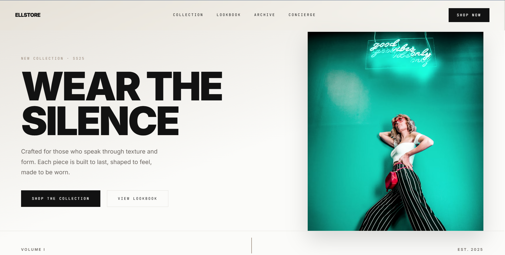

# Ellstore

A minimal fashion editorial storefront built with React and Vite.



---

## Stack

- **React 19** + **Vite 8**
- **Tailwind CSS v4** via `@tailwindcss/vite`
- **shadcn/ui** (Base UI) — Dialog, Breadcrumb
- **Motion** (Framer Motion v13) — scroll-driven animations, page transitions
- **React Router v7** — client-side routing
- **Inter** + **JetBrains Mono** — typography

## Pages

| Route | Description |
|---|---|
| `/` | Home — Hero, Lookbook, Collection, Pillars, CTA |
| `/collection` | Full collection with filters, sort, grid/list view |
| `/archive` | Past seasons with category filter |
| `/concierge` | Contact form |
| `/about` | Brand story |
| `/process` | How garments are made |
| `/stockists` | Retail locations |
| `/press` | Press contact |
| `/sizing-guide` | Measurements and fit |
| `/shipping` | Delivery information |
| `/returns` | Return policy |
| `/privacy` | Privacy policy |
| `/terms` | Terms of service |
| `/cookies` | Cookie policy |

## Getting started

```bash
npm install
npm run dev
```

## Commands

```bash
npm run dev      # development server
npm run build    # production build
npm run preview  # preview production build
npm run lint     # run oxlint
```
